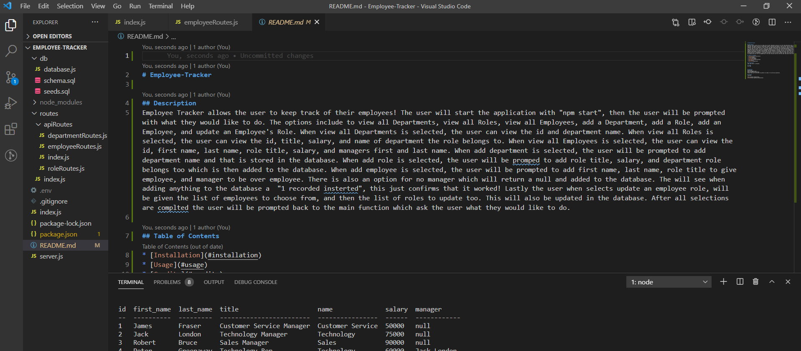

# Employee-Tracker

## Description
Employee Tracker allows the user to keep track of their employees! The user will start the application with "npm start", then the user will be prompted with what they would like to do. The options include to view all Departments, view all Roles, view all Employees, add a Department, add a Role, add an Employee, and update an Employee's Role. When view all Departments is selected, the user can view the id and department name. When view all Roles is selected, the user can view the id, title, salary, and name of department the role belongs to. When view all Employees is selected, the user can view the id, first name, last name, role title, salary, and managers first and last name. When add department is selected, the user will be prompted to add department name and that is stored in the database. When add role is selected, the user will be promped to add role title, salary, and department role belongs too which is then added to the database. When add employee is selected, the user will be prompted to add first name, last name, role title to give employee, and manager to be over employee. There is also an option for no manager which will return a null and added to the database. The will see when adding anything to the database a  "1 recorded insterted", this just confirms that it worked! Lastly the user when selects update an employee role, will be given the list of employees to choose from, and then the list of roles to update too. This will also be updated in the database. After all selections are complted the user will be prompted back to the main function which ask the user what they would like to do. 

## Table of Contents
- [Employee-Tracker](#employee-tracker)
  - [Description](#description)
  - [Table of Contents](#table-of-contents)
  - [Installation](#installation)
  - [Usage](#usage)
  - [Questions](#questions)
  - [License](#license)

## Installation
Type "npm start" in terminal.

## Usage
https://drive.google.com/file/d/1kZ2gECsdLeFVbsUP9vGwe7Hg3-6QxDYY/view

## Questions
Steven Baty
batysteven1@gmail.com
http://github.com/batysteven
Please reach out to me either by github or my email if you have any questions.

## License
undefined

http://github.com/batysteven
[GitHub](http://github.com/batysteven)
